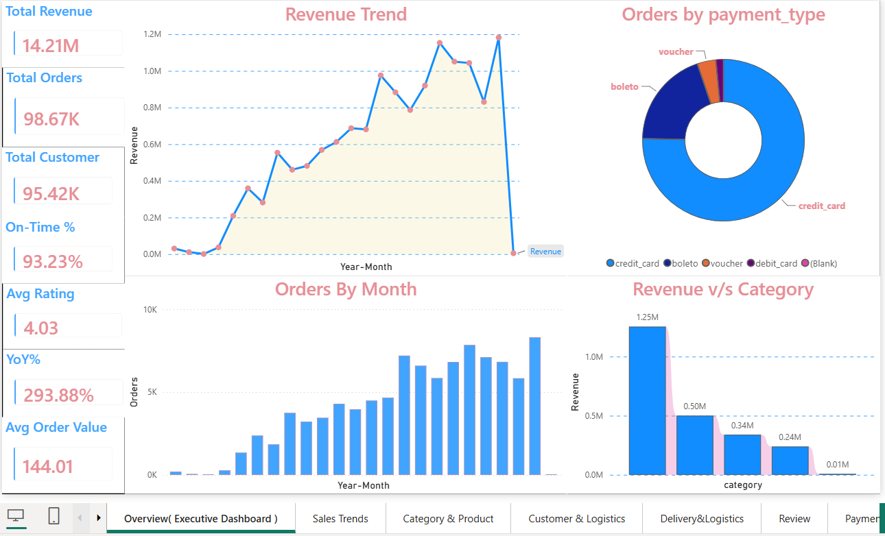
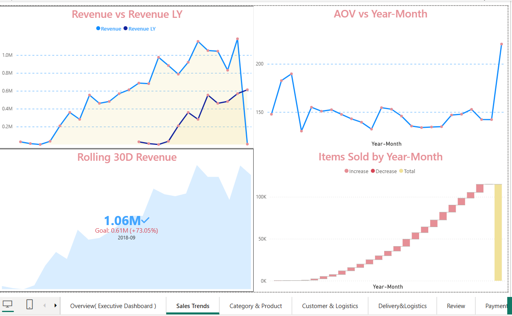
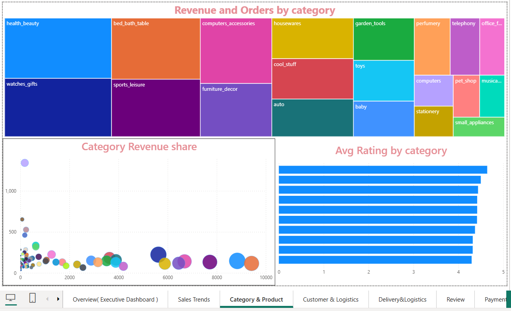
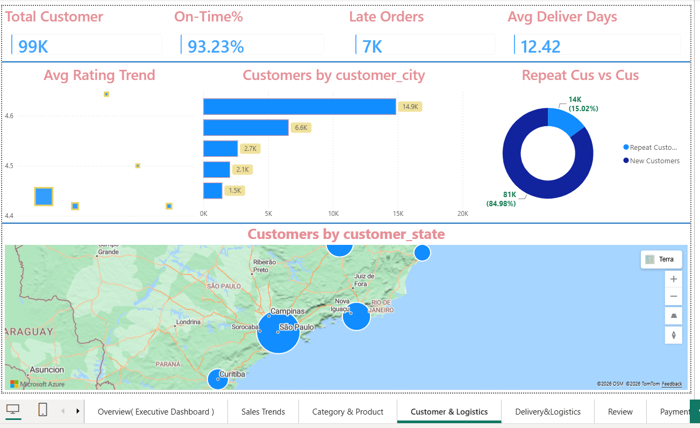
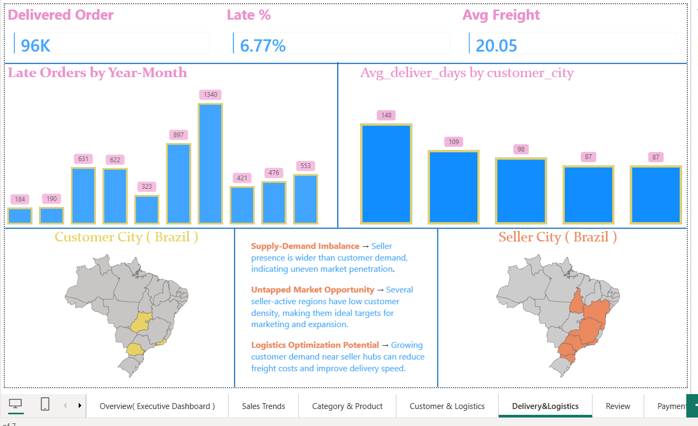
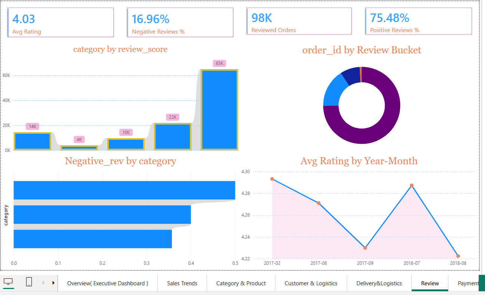
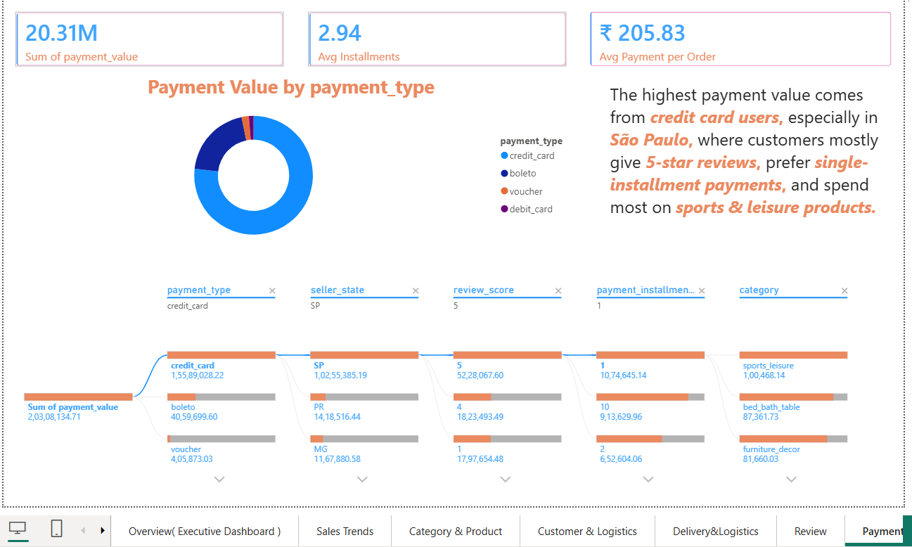
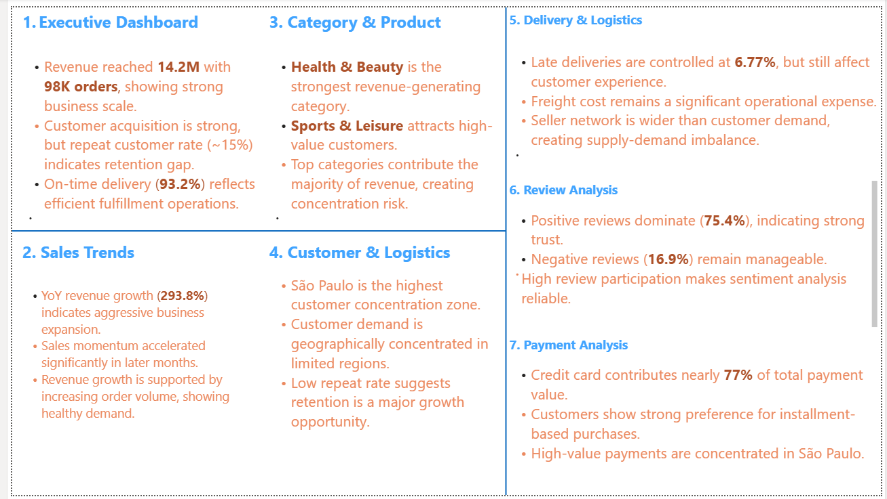

# 🛒 Olist E-Commerce Analytics — PostgreSQL + Power BI

An end-to-end business intelligence project built on the **Brazilian Olist E-Commerce dataset** (~100K orders). Raw CSV data is ingested into **PostgreSQL**, transformed via **analytical SQL views**, and connected live to **Power BI via DirectQuery** to produce an 8-page interactive dashboard covering Sales, Customers, Logistics, Reviews, Payments, and Sellers.

---

## 📌 Table of Contents

- [Project Architecture](#project-architecture)
- [Dataset](#dataset)
- [Database Setup](#database-setup)
- [SQL Views (BI Layer)](#sql-views-bi-layer)
- [Power BI Report](#power-bi-report)
- [DAX Measures — Complete Reference](#dax-measures--complete-reference)
- [Dashboard Pages](#dashboard-pages)
- [How to Run This Project](#how-to-run-this-project)
- [Folder Structure](#folder-structure)

---

## 🏗️ Project Architecture

```
CSV Files (Kaggle)
      ↓
PostgreSQL (Raw Tables)
      ↓
Indexes (Query Optimization)
      ↓
BI Views (Cleaned + Joined Virtual Tables)
      ↓
Power BI — DirectQuery Connection
      ↓
DAX Measures + DimDate Table
      ↓
8-Page Interactive Dashboard
```

---

## 📦 Dataset

**Source:** [Olist Brazilian E-Commerce — Kaggle](https://www.kaggle.com/datasets/olistbr/brazilian-ecommerce)

| File | Description |
|---|---|
| `olist_orders_dataset.csv` | Order status, timestamps, customer ID |
| `olist_order_items_dataset.csv` | Products, sellers, price, freight per item |
| `olist_customers_dataset.csv` | Customer city, state, unique ID |
| `olist_products_dataset.csv` | Product dimensions, category name |
| `olist_sellers_dataset.csv` | Seller city, state |
| `olist_order_payments_dataset.csv` | Payment type, installments, value |
| `olist_order_reviews_dataset.csv` | Review scores and comments |
| `olist_geolocation_dataset.csv` | Zip code lat/lng mapping |
| `product_category_name_translation.csv` | Portuguese → English category names |

> **Note:** CSVs are not included in this repo due to size. Download directly from Kaggle using the link above.

---

## 🗄️ Database Setup

### Step 1 — Create Tables

Run `sql/1_create_tables.sql` in pgAdmin or psql.

This creates all 9 raw tables with correct data types and primary keys:

```sql
-- Example: Orders table
CREATE TABLE olist_orders_dataset (
    order_id TEXT PRIMARY KEY,
    customer_id TEXT,
    order_status TEXT,
    order_purchase_timestamp TIMESTAMP,
    order_approved_at TIMESTAMP,
    order_delivered_carrier_date TIMESTAMP,
    order_delivered_customer_date TIMESTAMP,
    order_estimated_delivery_date TIMESTAMP
);
```

### Step 2 — Import Data

Run `sql/2_import_data.sql`. Update file paths to your local CSV location before running.

```sql
COPY olist_orders_dataset
FROM '/your/path/olist_orders_dataset.csv'
DELIMITER ',' CSV HEADER;
```

### Step 3 — Add Foreign Key Constraints

Defined in `sql/1_create_tables.sql` (end of file). Links orders → customers, items → orders/products/sellers, payments → orders, reviews → orders.

### Step 4 — Create Indexes

Run `sql/3_indexes.sql` to speed up join and filter performance:

```sql
-- Orders
CREATE INDEX IF NOT EXISTS ix_orders_order_id        ON olist_orders_dataset(order_id);
CREATE INDEX IF NOT EXISTS ix_orders_customer_id     ON olist_orders_dataset(customer_id);
CREATE INDEX IF NOT EXISTS ix_orders_purchase_date   ON olist_orders_dataset(order_purchase_timestamp);

-- Order Items
CREATE INDEX IF NOT EXISTS ix_items_order_id         ON olist_order_items_dataset(order_id);
CREATE INDEX IF NOT EXISTS ix_items_product_id       ON olist_order_items_dataset(product_id);
CREATE INDEX IF NOT EXISTS ix_items_seller_id        ON olist_order_items_dataset(seller_id);

-- Customers
CREATE INDEX IF NOT EXISTS ix_customers_customer_id  ON olist_customers_dataset(customer_id);
CREATE INDEX IF NOT EXISTS ix_customers_state        ON olist_customers_dataset(customer_state);

-- Payments
CREATE INDEX IF NOT EXISTS ix_payments_order_id      ON olist_order_payments_dataset(order_id);

-- Reviews
CREATE INDEX IF NOT EXISTS ix_reviews_order_id       ON olist_order_reviews_dataset(order_id);
```

---

## 🔍 SQL Views (BI Layer)

Run `sql/4_bi_views.sql`. These views act as the clean, optimized data layer consumed by Power BI — avoiding heavy raw table joins at report time.

### `bi_dim_product`
Joins products with English category translations. Calculates volume.

```sql
CREATE OR REPLACE VIEW bi_dim_product AS
SELECT
  p.product_id,
  COALESCE(t.product_category_name_english, p.product_category_name) AS category,
  p.product_weight_g,
  p.product_length_cm,
  p.product_height_cm,
  p.product_width_cm,
  (p.product_length_cm * p.product_height_cm * p.product_width_cm) AS volume_cm3
FROM olist_products_dataset p
LEFT JOIN product_category_name_translation t
  ON t.product_category_name = p.product_category_name;
```

### `bi_fact_review_latest`
Deduplicates reviews — keeps only the latest review per order.

```sql
CREATE OR REPLACE VIEW bi_fact_review_latest AS
SELECT DISTINCT ON (r.order_id)
  r.order_id,
  r.review_score,
  r.review_creation_date,
  r.review_answer_timestamp
FROM olist_order_reviews_dataset r
ORDER BY r.order_id, r.review_creation_date DESC NULLS LAST;
```

### `bi_fact_order`
Core order-level fact: delivery days, late flag, customer info.

```sql
CREATE OR REPLACE VIEW bi_fact_order AS
SELECT
  o.order_id,
  o.customer_id,
  o.order_status,
  o.order_purchase_timestamp::date AS purchase_date,
  date_trunc('month', o.order_purchase_timestamp)::date AS purchase_month,
  o.order_delivered_customer_date::date AS delivered_date,
  o.order_estimated_delivery_date::date AS estimated_date,
  CASE
    WHEN o.order_status = 'delivered'
     AND o.order_delivered_customer_date IS NOT NULL
    THEN (o.order_delivered_customer_date::date - o.order_purchase_timestamp::date)
    ELSE NULL
  END AS delivery_days,
  CASE
    WHEN o.order_status = 'delivered'
     AND o.order_delivered_customer_date IS NOT NULL
     AND o.order_estimated_delivery_date IS NOT NULL
     AND o.order_delivered_customer_date::date > o.order_estimated_delivery_date::date
    THEN 1 ELSE 0
  END AS is_late,
  c.customer_unique_id,
  c.customer_city,
  c.customer_state
FROM olist_orders_dataset o
JOIN olist_customers_dataset c ON c.customer_id = o.customer_id;
```

### `bi_fact_sales` ⭐ (Main view used in Power BI)
The master denormalized view joining all dimensions into one flat table for Power BI consumption.

```sql
CREATE OR REPLACE VIEW bi_fact_sales AS
SELECT
  oi.order_id, oi.order_item_id, oi.product_id, oi.seller_id,
  oi.shipping_limit_date::date AS shipping_limit_date,
  oi.price, oi.freight_value,
  fo.customer_id, fo.customer_unique_id, fo.order_status,
  fo.purchase_date, fo.purchase_month,
  fo.delivered_date, fo.estimated_date,
  fo.delivery_days, fo.is_late,
  fo.customer_city, fo.customer_state,
  dp.category,
  r.review_score,
  p.payment_type, p.payment_installments, p.payment_value,
  s.seller_city, s.seller_state
FROM olist_order_items_dataset oi
JOIN bi_fact_order fo ON fo.order_id = oi.order_id
LEFT JOIN bi_dim_product dp ON dp.product_id = oi.product_id
LEFT JOIN bi_fact_review_latest r ON r.order_id = oi.order_id
LEFT JOIN olist_order_payments_dataset p ON p.order_id = oi.order_id
LEFT JOIN olist_sellers_dataset s ON s.seller_id = oi.seller_id;
```

### `bi_payments_order`
Aggregates payment data per order — dominant payment type, total value, max installments.

```sql
CREATE OR REPLACE VIEW bi_payments_order AS
SELECT
  op.order_id,
  SUM(op.payment_value) AS order_payment_value,
  MAX(op.payment_installments) AS order_payment_installments,
  (ARRAY_AGG(op.payment_type ORDER BY op.payment_value DESC NULLS LAST))[1] AS order_payment_type
FROM olist_order_payments_dataset op
GROUP BY op.order_id;
```

---

## 📊 Power BI Report

- **Connection Mode:** DirectQuery (live connection to PostgreSQL)
- **Primary Table:** `bi_fact_sales` view
- **Date Table:** `DimDate` (imported, calculated table)

### DimDate Table (DAX Calculated Table)

```dax
DimDate =
ADDCOLUMNS(
    CALENDAR(
        MIN('public bi_fact_sales'[purchase_date]),
        MAX('public bi_fact_sales'[purchase_date])
    ),
    "Year",        YEAR([Date]),
    "Month No",    MONTH([Date]),
    "Month",       FORMAT([Date], "MMM"),
    "Year-Month",  FORMAT([Date], "YYYY-MM"),
    "Quarter",     "Q" & FORMAT([Date], "Q"),
    "Weekday No",  WEEKDAY([Date], 2),
    "Weekday",     FORMAT([Date], "DDD"),
    "Month Start", DATE(YEAR([Date]), MONTH([Date]), 1)
)
```

---

## 📐 DAX Measures — Complete Reference

### 🔵 Base Measures

```dax
Revenue =
SUM ( 'public bi_fact_sales'[price] )
```
> Total product revenue (excludes freight).

```dax
Freight =
SUM ( 'public bi_fact_sales'[freight_value] )
```
> Total shipping cost charged to customers.

```dax
GMV =
[Revenue] + [Freight]
```
> Gross Merchandise Value — total transaction value including freight.

```dax
Orders =
DISTINCTCOUNT ( 'public bi_fact_sales'[order_id] )
```
> Count of unique orders.

```dax
Customers =
DISTINCTCOUNT ( 'public bi_fact_sales'[customer_unique_id] )
```
> Count of unique customers (uses `customer_unique_id` to avoid counting repeat buyers multiple times).

```dax
Items Sold =
COUNTROWS ( 'public bi_fact_sales' )
```
> Total line items sold (one order can have multiple items).

```dax
AOV =
DIVIDE ( [Revenue], [Orders] )
```
> Average Order Value — revenue per order.

```dax
Items per Order =
DIVIDE ( [Items Sold], [Orders] )
```
> Average number of items per order.

```dax
Avg Rating =
AVERAGE ( 'public bi_fact_sales'[review_score] )
```
> Mean review score (1–5 scale).

```dax
Delivered Orders =
CALCULATE ( [Orders], 'public bi_fact_sales'[order_status] = "delivered" )
```
> Count of orders with status = "delivered".

```dax
Late Orders =
CALCULATE (
    [Orders],
    'public bi_fact_sales'[order_status] = "delivered",
    'public bi_fact_sales'[is_late] = 1
)
```
> Delivered orders that arrived after the estimated delivery date.

```dax
On-time % =
DIVIDE ( [Delivered Orders] - [Late Orders], [Delivered Orders] )
```
> Percentage of delivered orders that arrived on or before the estimated date.

---

### 🟡 Time Intelligence Measures

```dax
Revenue YTD =
TOTALYTD ( [Revenue], DimDate[Date] )
```
> Year-to-date revenue, resets at the start of each calendar year.

```dax
Revenue LY =
CALCULATE ( [Revenue], SAMEPERIODLASTYEAR ( DimDate[Date] ) )
```
> Revenue for the same period in the previous year — used as YoY baseline.

```dax
YoY % =
DIVIDE ( [Revenue] - [Revenue LY], [Revenue LY] )
```
> Year-over-Year revenue growth percentage.

```dax
Rolling 30D Revenue =
CALCULATE(
    [Revenue],
    DATESINPERIOD ( DimDate[Date], MAX ( DimDate[Date] ), -30, DAY )
)
```
> Revenue over the trailing 30 days from the current date context.

```dax
Rolling 30D Revenue LY =
CALCULATE(
    [Rolling 30D Revenue],
    SAMEPERIODLASTYEAR ( DimDate[Date] )
)
```
> Rolling 30-day revenue for the same window in the prior year.

---

### 🟢 Customer Measures

```dax
Total_Customer =
DISTINCTCOUNT ( 'public bi_fact_sales'[customer_id] )
```
> Total customer count (including repeat buyers counted per order).

```dax
Repeat Customers =
COUNTROWS(
    FILTER(
        VALUES ( 'public bi_fact_sales'[customer_unique_id] ),
        CALCULATE ( COUNTROWS ( 'public bi_fact_sales' ) ) > 1
    )
)
```
> Customers who placed more than one order.

```dax
New Customers =
[Customers] - [Repeat Customers]
```
> First-time buyers.

```dax
Reviewed Orders =
CALCULATE(
    [Orders],
    NOT ( ISBLANK ( 'public bi_fact_sales'[review_score] ) )
)
```
> Orders that received a review.

---

### 🟠 Logistics & Delivery Measures

```dax
Avg Delivery Days =
AVERAGE ( 'public bi_fact_sales'[delivery_days] )
```
> Mean number of days from order placement to delivery.

```dax
Avg_deliver_days =
AVERAGE ( 'public bi_fact_sales'[delivery_days] )
```
> Duplicate of above — used on Customer page (Page 4).

```dax
Late % =
DIVIDE ( [Late Orders], [Delivered Orders] )
```
> Percentage of delivered orders that were late.

---

### 🔴 Review Sentiment Measures

```dax
Positive Reviews % =
DIVIDE(
    CALCULATE(
        COUNTROWS ( 'public bi_fact_sales' ),
        'public bi_fact_sales'[review_score] >= 4
    ),
    CALCULATE(
        COUNTROWS ( 'public bi_fact_sales' ),
        NOT ISBLANK ( 'public bi_fact_sales'[review_score] )
    )
)
```
> Share of reviews scoring 4 or 5 out of total reviewed orders.

```dax
Negative Reviews % =
DIVIDE(
    CALCULATE(
        COUNTROWS ( 'public bi_fact_sales' ),
        'public bi_fact_sales'[review_score] <= 2
    ),
    CALCULATE(
        COUNTROWS ( 'public bi_fact_sales' ),
        NOT ISBLANK ( 'public bi_fact_sales'[review_score] )
    )
)
```
> Share of reviews scoring 1 or 2 out of total reviewed orders.

```dax
Review Bucket =
SWITCH(
    TRUE(),
    ISBLANK ( 'public bi_fact_sales'[review_score] ), "No Review",
    'public bi_fact_sales'[review_score] >= 4,         "Positive (4-5)",
    'public bi_fact_sales'[review_score] = 3,          "Neutral (3)",
    "Negative (1-2)"
)
```
> Calculated column that buckets each review into Positive / Neutral / Negative / No Review.

---

### 🟣 Payment Measures

```dax
Payment Value =
SUM ( 'public bi_fact_sales'[payment_value] )
```
> Total payment value processed (may differ from Revenue due to installment timing).

```dax
Avg Installments =
AVERAGE ( 'public bi_fact_sales'[payment_installments] )
```
> Average number of installments chosen by customers.

```dax
Avg Payment per Order =
DIVIDE ( [Payment Value], [Orders] )
```
> Average payment collected per order.

```dax
Installment Burden % =
DIVIDE ( [Avg Installments], [Orders] )
```
> Ratio of average installments to order count — proxy for installment dependency.

---

### ⚪ Seller Measures

```dax
Sellers =
DISTINCTCOUNT ( 'public bi_fact_sales'[seller_id] )
```
> Count of unique active sellers.

```dax
Revenue per Seller =
DIVIDE ( [Revenue], [Sellers] )
```
> Average revenue contribution per seller.

---

### ⚫ Drillthrough

```dax
Drill Title =
"Drillthrough: " &
COALESCE ( SELECTEDVALUE ( 'public bi_fact_sales'[category] ), "All" )
```
> Dynamic page title that updates based on which category is drilled through.

---


## 📊 Dashboard Preview

### 1. Executive Overview


---

### 2. Sales Trends


---

### 3. Category & Product Analysis


---

### 4. Customer & Logistics


---

### 5. Delivery & Logistics


---

### 6. Review Analysis


---

### 7. Payment Analysis


---

### 8. Insights Summary


---

## ⚙️ How to Run This Project

### Prerequisites
- PostgreSQL 14+ with pgAdmin
- Power BI Desktop (latest)
- Olist dataset CSVs from Kaggle

### Steps

```
1. Download Olist dataset from Kaggle and extract CSVs
2. Create a new PostgreSQL database: olist_db
3. Run sql/1_create_tables.sql    → creates all 9 raw tables + foreign keys
4. Update file paths in sql/2_import_data.sql and run it
5. Run sql/3_indexes.sql          → adds performance indexes
6. Run sql/4_bi_views.sql         → creates 5 analytical views
7. Validate: SELECT COUNT(*) FROM bi_fact_sales; (expect ~112K rows)
8. Open Power BI Desktop
9. Get Data → PostgreSQL → DirectQuery
10. Load bi_fact_sales view (+ optional dim views)
11. Create DimDate as a calculated table (DAX from powerbi/dax_measures.md)
12. Build relationships: DimDate[Date] → bi_fact_sales[purchase_date]
13. Add all DAX measures from powerbi/dax_measures.md
14. Build report pages and apply slicers/filters
```

---

## 📁 Folder Structure

```
olist-ecommerce-analytics/
│
├── README.md
│
├── sql/
│   ├── 1_create_tables.sql        # Raw table DDL + FK constraints
│   ├── 2_import_data.sql          # COPY commands for CSV ingestion
│   ├── 3_indexes.sql              # Performance indexes
│   └── 4_bi_views.sql             # All 5 BI views
│
├── powerbi/
│   ├── REPORT.pbix                # Power BI report file
│   └── dax_measures.md            # All DAX measures with explanations
│
└── dataset/
    └── README.md                  # Kaggle link + table descriptions
```

---

## 📎 References

- Dataset: [Olist Brazilian E-Commerce on Kaggle](https://www.kaggle.com/datasets/olistbr/brazilian-ecommerce)
- Tutorial: [PostgreSQL + Power BI End-to-End Project — Dhanesh Malviya](https://youtu.be/dnKICi3hAko)

---

*Built as a learning project to practice end-to-end BI development: data ingestion → SQL modeling → analytical views → Power BI dashboard with DAX.*
